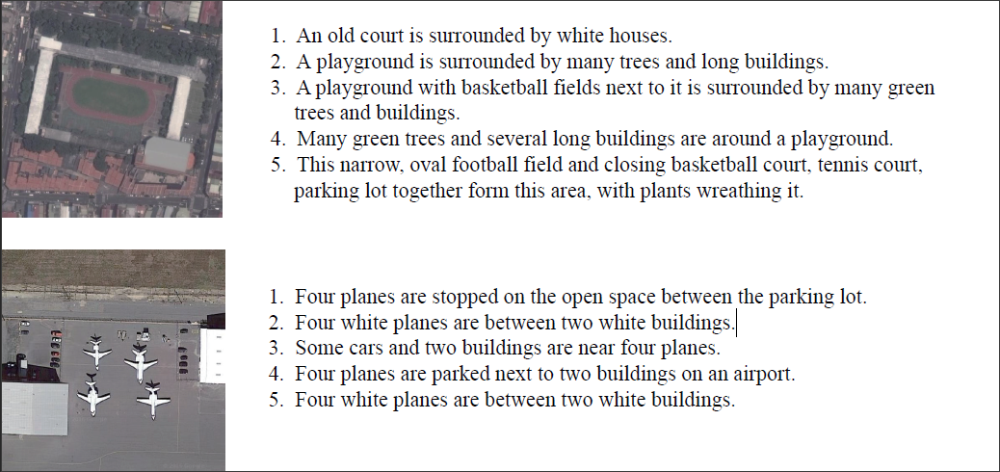

# RSICD(Remote Sensing Image Captioning Dataset)
RSICD is used for remote sensing image captioning task. The detailed information about this dataset can be found in our paper "Exploring Models and Data for Remote Sensing Image Caption Generation".
If you use our dataset, please cite our paper above. 

[1] X. Lu, B. Wang, X. Zheng and X. Li, "Exploring Models and Data for Remote Sensing Image Caption Generation," IEEE Transactions on Geoscience and Remote Sensing, 2017.

@article{lu2017exploring,  
title={Exploring models and data for remote sensing image caption generation},  
author={Lu, Xiaoqiang and Wang, Binqiang and Zheng, Xiangtao and Li, Xuelong},
journal={IEEE Transactions on Geoscience and Remote Sensing},  
volume={56},  
number={4},  
pages={2183--2195},  
year={2017},  
publisher={IEEE}  
}

## Overview

RSICD is used for remote sensing image captioning task. more than ten thousands remote sensing images are collected from Google Earth, Baidu Map, MapABC, Tianditu. The images are fixed to 224X224 pixels with various resolutions. The total number of remote sensing images are 10921, with five sentences descriptions per image. To the best of our knowledge, this dataset is the largest dataset for remote sensing captioning. The sample images in the dataset are with high intra-class diversity and low inter-class dissimilarity. Thus, this dataset provides the researchers a data resource to advance the task of remote sensing captioning.

**Git downloads are size limited, need to use large file storage (LFS), and also need to modify the settings, specifically see [here](http://blog.csdn.net/m0_37052320/article/details/77799413). It is recommended that you download from the Google SkyDrive and Baidu SkyDrive.**

**注意：git下载是有大小限制的，需要使用大文件存储（LFS）,还需要修改设置，具体参见[这里](http://blog.csdn.net/m0_37052320/article/details/77799413)。推荐大家使用下面的谷歌网盘和百度网盘下载。**

## Examples

There are two examples in dataset:

  

## Other Source of RSICD Datasets 

[Baidupan](http://pan.baidu.com/s/1bp71tE3)

[GoogleDrive](https://drive.google.com/open?id=0B1jt7lJDEXy3aE90cG9YSl9ScUk)

## Other remote sensing image captioning dataset

[UCM_captions-BaiduPan](https://pan.baidu.com/s/1mjPToHq)

[Sydney_captions-BaiduPan](https://pan.baidu.com/s/1hujEmcG)

[UCM_captions-MEGA](https://mega.nz/folder/wCpSzSoS#RXzIlrv--TDt3ENZdKN8JA)

[RSICD-MEGA](https://mega.nz/folder/EOpjTAwL#LWdHVjKAJbd3NbLsCvzDGA)

[Sydney_captions-MEGA](https://mega.nz/folder/pG4yTYYA#4c4buNFLibryZnlujsrwEQ)
